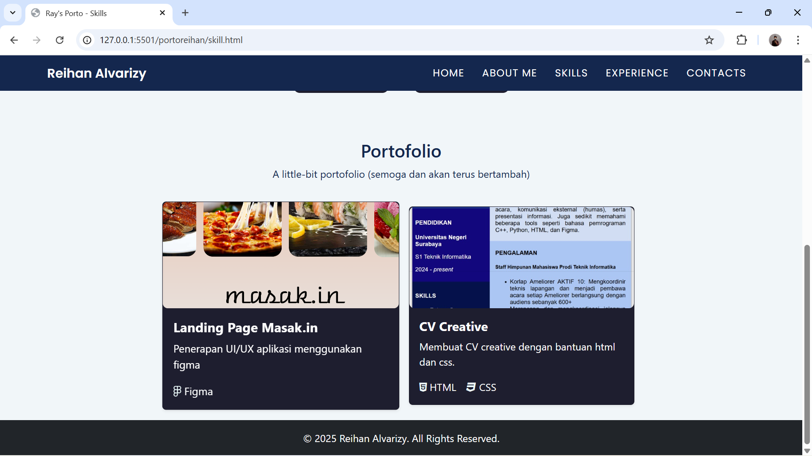

# Ray's Portfolio Website ✨💻

## Deskripsi Projek Singkat 📝
Ray's Portfolio Website dibuat sebagai media untuk menampilkan profil, keterampilan, pengalaman, dan kontak secara interaktif.  
Projek ini dikembangkan menggunakan HTML, CSS (Bootstrap + custom styles), dan JavaScript dengan fokus pada tampilan yang responsif serta animasi yang halus.  

Website ini menghadirkan efek animasi scroll reveal, interaksi hover pada kartu, dan progress bar yang terisi otomatis untuk menciptakan pengalaman pengguna yang dinamis dan menarik.  
Tujuan utamanya adalah menghadirkan portofolio digital yang modern, informatif, dan merepresentasikan semangat dalam bidang teknologi dan pengembangan web.

### 🛠️ Teknologi yang Digunakan

* **HTML:** Digunakan untuk membangun struktur dasar konten setiap halaman.
* **Bootstrap 5:** Diimplementasikan untuk tata letak yang responsif, navigasi, dan komponen seperti *card* dan *modal*.
* **CSS Kustom (`project1.css`):** Digunakan untuk gaya visual, penyesuaian warna, dan efek *hover* pada navigasi.
* **Vanilla JavaScript (`project1.js`):** Digunakan untuk logika interaktivitas utama.

### 🌟 Fitur Utama Website

* **Navigasi Fixed-Top 🧭:** Bilah navigasi yang tetap di bagian atas layar dengan efek *hover* yang halus.
* **Animasi *Scroll* (Reveal) 📜:** Menggunakan **`Intersection Observer`** di JavaScript untuk membuat elemen muncul (`.hidden` menjadi `.show`) saat pengguna menggulir halaman.
* **Efek Zoom/Scale pada Kartu 🔍:** Kartu *Skills* dan *Experience* akan membesar (`transform: scale()`) saat kursor digeser di atasnya (*hover*), memberikan interaksi yang halus.
* **Progress Bar Keterampilan 📊:** Bilah kemajuan di halaman **Skills** akan mengisi secara visual saat bagian tersebut terlihat di *viewport*, dipicu oleh `Intersection Observer`.
* **Modal Galeri Proyek 🖼️:** Menggunakan **Modal Bootstrap** untuk menampilkan gambar proyek (*screenshot*) secara penuh (zoom) di halaman **Skills**.
* **Halaman Pengalaman Organisasi 🎓:** Menampilkan pengalaman pendidikan dan organisasi dalam format *card* yang informatif.

## Struktur File Projek 📁

* `index.html`: Halaman **HOME** (Beranda) dengan perkenalan utama.
* `aboutme.html`: Halaman **ABOUT ME** (Tentang Saya) dengan profil dan minat.
* `skill.html`: Halaman **SKILLS** (Keterampilan) yang menampilkan *progress bar* dan portofolio.
* `experience.html`: Halaman **EXPERIENCE** (Pengalaman) yang mencantumkan pendidikan dan organisasi.
* `contact.html`: Halaman **CONTACTS** (Kontak) yang berisi formulir kontak dan *social link*.
* `project1.css`: File gaya kustom untuk seluruh proyek.
* `project1.js`: File logika JavaScript untuk efek animasi.

## Screenshot Tampilan Website 📸

### 1. Home Page

### 2. About Me Page

### 3. Skills Page

### 4. Experience Page

### 5. Contacts Page

Halaman contacts dilengkapi dengan fitur link href yang jika logo/link ditekan, akan langsung <i>direct</i> menuju tujuan social media masing-masing. 

---

## Link Video YouTube ▶️
[https://youtu.be/QJieYqAVLCc]
